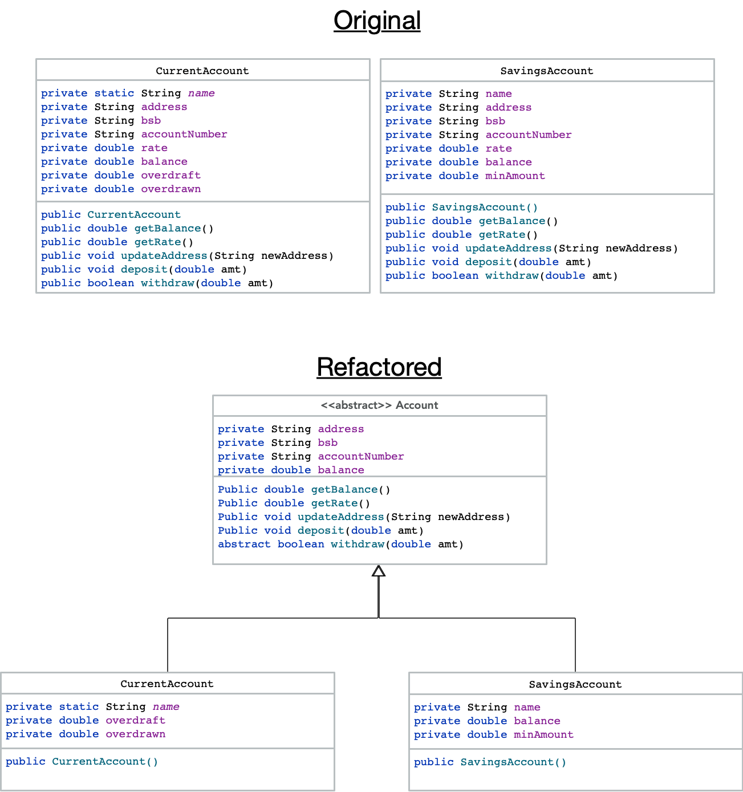

#### 2.1: Please add the Class Diagram here.

Here is the class diagram...

  

#### 2.2.A: Name at least 3 smells that you identified BEFORE making the change of point 2.1, and provide your reasons. Is there any specific smell that is solved with the extract superclass? _No less than 350 words_.
  
WRITE YOUR ANSWER HERE

With the original “***Current account***” and “***Savings Account***” Classes, There was considerable code duplication in the class properties with respect to the following class properties : *name, Address,  [bank] BSB, [Bank] Account number, [Interest] rate, [Bank account] balance*.

In addition, there was considerable duplication in the class methods with respect to *“getBalance()”, “getRate()”, “updateAddress(String newAddress)”, “deposit(double amt)”, “withdraw(double amt)*”, as these method had the same implementation body. However the implementation of the “withdraw(double amt)” method in these classes were different.

In analyzing this application code, there are three code smell candidates:
-  “**Data clumps**”, Where different parts of the application code Contain identical groups of variables, as given in the properties of “CurrentAccount”, and “SavingsAccount”.

-  “**Long parameter list**”, In which there is more than three or four perimeters for a method, which is certainly the case with the constructor for “CurrentAccount”, and “SavingsAccount”, with. “CurrentAccount(String name,String address,String bsb,String accountNumber,double rate,double balance,double overdraft)” and “SavingsAccount(String name,String address,String bsb,String accountNumber,double rate,double balance,double minAmount)” respectively.

- "**Code duplication**" is the most likely candidate.

The problems with code duplication in an application:
- The application that has duplicate application code choose up memory resources and will impact the application performance, which is demonstrated by the large overlapping of application code between “CurrentAccount” and “SavingsAccount”.

- By “copy paste programming” results in duplicate code, which can introduce security vulnerabilities that attackers can exploit to gain access to your application code.

- Having duplicate code in a large application can increase the difficulty to maintain low software defect application code..

From this analysis as it appears that code duplication appears to be the most likely candidate, then using the “**Extracting the SuperClass**” refactoring technique, resolves the “duplicate code” code smell, as it has procedures for pulling up class data properties, and class methods,
  

#### 2.2.B: Mention other refactorings that you did when you _extracted the superclass_. Were these refactorings needed for the _extract superclass_? Why? Could you have used _extract interface_ instead? _No less than 250 words_.

WRITE YOUR ANSWER HERE

this is a test..